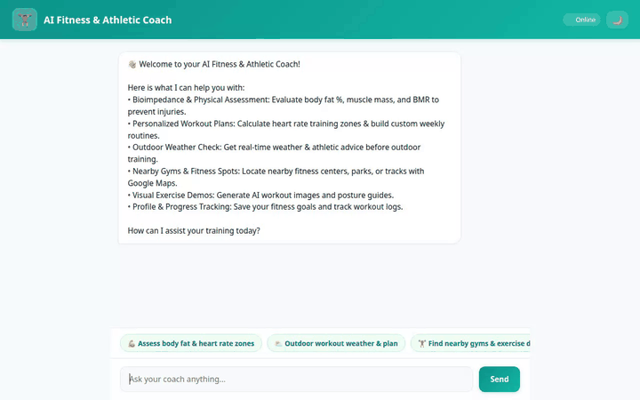

# AI Fitness & Athletic Coach Agent

An intelligent, stateful AI Fitness & Athletic Coach agent built with Google Cloud's Agent Development Kit (ADK), Vertex AI Agent Engine, Google GenAI SDK, and A2UI (v0.8) rich component rendering.



---

## Capabilities & Architecture

The AI Fitness Coach agent provides specialized athletic planning, zone calculations, workout tracking, location services, and multi-modal media generation using Google Cloud services:

### 🧠 Cross-Session Long-Term Memory
- **Vertex AI Memory Bank**: Integrates `PreloadMemoryTool` and `generate_memories_callback` to automatically record, recall, and persist athlete preferences, goals, injury notes, and fitness history across chat sessions.

### 💾 Structured Profile & Workout Storage
- **Google Cloud Firestore**: Persists user profiles (`save_user_profile`, `get_user_profile`) and workout logs (`add_workout_log`, `list_workout_logs`, `get_workout_log`).

### ☁️ Cloud Storage Asset Repository
- **Public Cloud Storage Bucket**: Stores multi-modal assets (generated workout images and exercise videos) directly in Google Cloud Storage (`fitness-coach-assets-qwiklabs-gcp-02-22f397fe66a7`).

### 🖼️ Multi-Modal Media Generation
- **Image Generation (`generate_workout_image`)**: Calls Google's `gemini-3.1-flash-lite-image` model in the `global` region to create custom athletic visual guides, route graphics, and motivational imagery.
- **Exercise Demo Video Generation (`generate_exercise_demo_video`)**: Uses Google's Omni model `gemini-omni-flash-preview` in the `global` region to generate 5-second movement and posture demonstration videos. Saves output as ADK Playground artifacts and uploads public GCS URLs.

### 🎨 Rich Dynamic UI (A2UI v0.8)
- **A2UI Schema Manager & Basic Catalog**: Leverages `a2ui-agent-sdk` v0.8 to dynamically return rich component UI surfaces (cards, column layouts, text blocks, image displays, and divider lines) rendered directly in the chat interface.

### 📍 Location & Nearby Places
- **Google Maps Geocoding API (`geocode_address`)**: Converts addresses and city names to latitude and longitude coordinates.
- **Google Places API New (`find_nearby_places`)**: Locates nearby gyms, fitness centers, tracks, and parks tailored to user requests.

### 🌤️ Live Weather Integration
- **Open-Meteo Weather API (`fetch_outdoor_workout_weather`)**: Fetches real-time temperature, wind speed, precipitation, and conditions before outdoor runs or cycling workouts.

### 📊 Athletic Analytics & Physiology
- **Karvonen & Power Zone Calculations (`calculate_training_zones`)**: Computes Karvonen heart-rate training zones (Zones 1–5) and FTP cycling power zones (Zones 1–7).
- **Bioimpedance Assessment (`analyze_bioimpedance`)**: Analyzes body fat %, skeletal muscle mass, total body water, and visceral fat ratings.
- **Weekly Training Schedule Generator (`generate_weekly_plan`)**: Generates structured multi-week workout plans based on athletic targets.

### 🐍 Sandbox Code Execution
- **Vertex AI Agent Engine Python Sandbox**: Runs isolated Python code for custom data transformations and analytics via `_get_code_executor()`.

---

## Project Structure

```text
.
├── app/
│   ├── agent.py            # ADK Root Agent definition, memory callbacks & system prompts
│   ├── tools.py            # Tools (Firestore, GCS, GenAI, Maps, Weather, Zones, Bioimpedance)
│   ├── a2ui_utils.py       # A2UI callback transformer for A2A protocol surface rendering
│   └── database.py         # Firestore database client helper
├── frontend/
│   ├── main.py             # FastAPI proxy communicating with deployed agent via A2A
│   ├── static/index.html   # Modern responsive chat UI with A2UI card renderer & dark mode
│   └── requirements.txt    # Frontend dependencies
├── demo.gif                # Recorded interactive agent demo
├── agents-cli-manifest.yaml # Agent manifest configuration
└── pyproject.toml          # Python project dependencies
```

---

## Local Setup & Development

### Prerequisites
- Python 3.11+
- `uv` package manager (`curl -LsSf https://astral.sh/uv/install.sh | sh`)
- Google Cloud Service Account credentials with access to Vertex AI, Firestore, and Cloud Storage.

### 1. Backend Agent Setup
Install dependencies and run the backend agent in local development mode using `adk`:

```bash
# Install agent dependencies
uv sync

# Launch backend agent development server with Memory Bank
uv run adk web . --port 8000 --reload_agents --memory_service_uri=agentengine://<YOUR_REASONING_ENGINE_ID>
```

### 2. Frontend Application Setup
Navigate to the `frontend/` directory, set environment variables, and launch the web server:

```bash
# Navigate to frontend
cd frontend

# Install frontend dependencies
uv pip install -r requirements.txt

# Set required environment variables
export AGENT_ENGINE_RESOURCE_NAME="projects/<PROJECT_ID>/locations/us-central1/reasoningEngines/<REASONING_ENGINE_ID>"
export AGENT_DIRECTORY="app"
export PORT=8080

# Start frontend server
uv run python main.py
```

Open a browser and navigate to port `8080` on your local host environment to interact with the agent.
